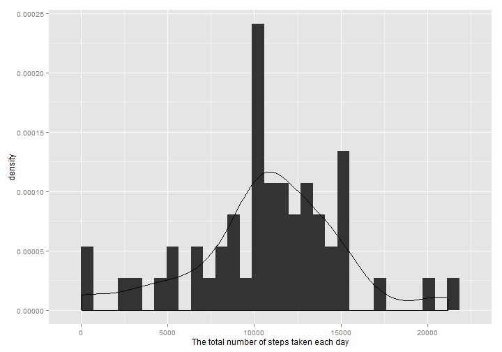
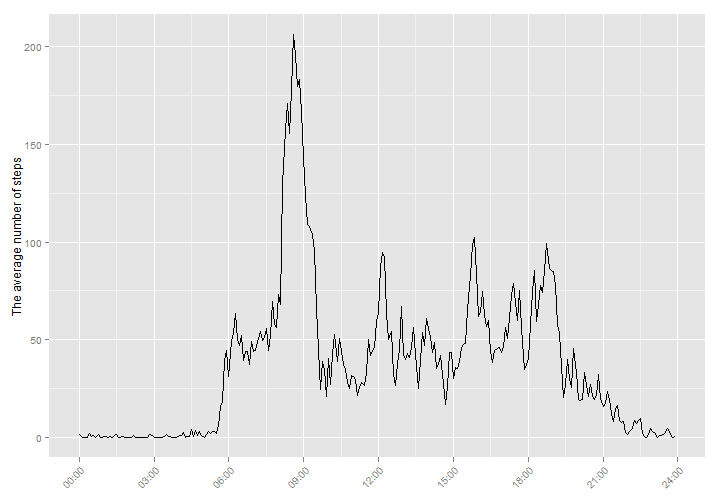
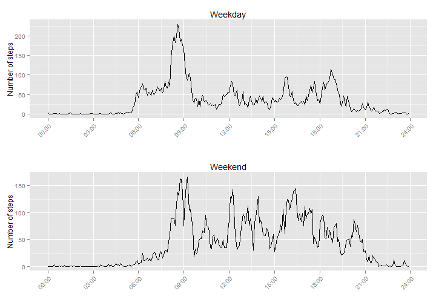

## Loading and preprocessing the data


```r
activity <- read.csv("activity.csv")
activity$date <- as.Date(activity$date, "%Y-%m-%d")

library(ggplot2)
library(grid)
library(gridExtra)
```

```
## Warning: package 'gridExtra' was built under R version 3.1.3
```

```r
Sys.setlocale("LC_TIME", "C")
```

```
## [1] "C"
```

## What is mean total number of steps taken per day?


```r
x_sum <- tapply(activity$steps, activity$date, sum)
sum_data <- data.frame(row = seq_len(nrow(x_sum)), date = names(x_sum), sum = as.numeric(x_sum))
sum_data[is.na(sum_data)] <- 0

steps_mean <- mean(sum_data$sum, na.rm = TRUE)
steps_median <- median(sum_data$sum, na.rm = TRUE)

ggplot(sum_data, aes(x=date, y=sum)) +
    geom_bar(stat="identity") +
    ylab("Number of steps") +
    theme(axis.title.x = element_blank(), axis.text.x = element_text(angle = 45, hjust = 1))
```

 

The **mean** of the total number of steps taken per day is **9354.2295082**.

The **median** of the total number of steps taken per day is **1.0395 &times; 10<sup>4</sup>**.

## What is the average daily activity pattern?


```r
x5 <- tapply(activity$steps, activity$interval, mean, na.rm = TRUE)
x5_data <- data.frame(row = seq_len(nrow(x5)), interval = names(x5), mean = as.numeric(x5))

x5_max <- which.max(x5)

ggplot(x5_data, aes(x=row, y=mean)) +
    geom_line(stat="identity") +
    ylab("The average number of steps") +
    theme(axis.title.x = element_blank(), axis.text.x = element_text(angle = 45, hjust = 1)) +
    scale_x_continuous(breaks=c(1,37,73,109,145,181,217,253,289),
                       labels=c("00:00", "03:00", "06:00", "09:00", "12:00",
                                "15:00", "18:00", "21:00", "24:00"))
```

 


5-minute interval **835** contains the maximum number of steps.

## Imputing missing values


```r
na_act <- is.na(activity)
na_act <- as.data.frame(na_act)
na_total <- nrow(subset(na_act, steps == TRUE))
```

The total number of missing values in the dataset = **2304**.

Creating a new dataset that is equal to the original dataset but with the missing data filled in. The strategy for filling is the mean for that 5-minute interval.


```r
new_activity <- activity
for(i in 1:17568) {
    if(is.na(new_activity$steps[i])) {
        new_activity$steps[i] <- x5_data$mean[x5_data$interval == new_activity$interval[i]]
    }
}

nx_sum <- tapply(new_activity$steps, new_activity$date, sum)
nsum_data <- data.frame(row = seq_len(nrow(nx_sum)), date = names(nx_sum),
                        sum = as.numeric(nx_sum))
new_steps_mean <- mean(nsum_data$sum)
new_steps_median <- median(nsum_data$sum)

ggplot(nsum_data, aes(x=date, y=sum)) +
    geom_bar(stat="identity") +
    ylab("Number of steps") +
    theme(axis.title.x = element_blank(), axis.text.x = element_text(angle = 45, hjust = 1))
```

 

The **mean** of the total number of steps taken per day is **1.0766189 &times; 10<sup>4</sup>**.

The **median** of the total number of steps taken per day is **1.0766189 &times; 10<sup>4</sup>**.

## Are there differences in activity patterns between weekdays and weekends?


```r
new_activity$weekday <- weekdays(new_activity$date)

for(i in 1:17568) {
    if(new_activity$weekday[i] == "Saturday" | new_activity$weekday[i] == "Sunday")
        { new_activity$weekday[i] <- "weekend" }
    else { new_activity$weekday[i] <- "weekday" }
}

new_activity$weekday = as.factor(new_activity$weekday)

weekday_data <- subset(new_activity, weekday == "weekday")
weekend_data <- subset(new_activity, weekday == "weekend")

wx5_day <- tapply(weekday_data$steps, weekday_data$interval, mean, na.rm = TRUE)
wx5_daydata <- data.frame(row = seq_len(nrow(wx5_day)), interval = names(wx5_day),
                          mean = as.numeric(wx5_day))

wx5_end <- tapply(weekend_data$steps, weekend_data$interval, mean, na.rm = TRUE)
wx5_enddata <- data.frame(row = seq_len(nrow(wx5_end)), interval = names(wx5_end),
                           mean = as.numeric(wx5_end))

p1 <- ggplot(wx5_daydata, aes(x=row, y=mean)) +
    geom_line(stat="identity") +
    ylab("Number of steps") +
    ggtitle("Weekday") +
    theme(axis.text.x = element_text(angle = 45, hjust = 1)) +
    scale_x_continuous(breaks=c(1,37,73,109,145,181,217,253,289),
                       labels=c("00:00", "03:00", "06:00", "09:00", "12:00",
                                "15:00", "18:00", "21:00", "24:00"))

p2 <- ggplot(wx5_enddata, aes(x=row, y=mean)) +
    geom_line(stat="identity") +
    ylab("Number of steps") +
    ggtitle("Weekend") +
    theme(axis.text.x = element_text(angle = 45, hjust = 1)) +
    scale_x_continuous(breaks=c(1,37,73,109,145,181,217,253,289),
                       labels=c("00:00", "03:00", "06:00", "09:00", "12:00",
                                "15:00", "18:00", "21:00", "24:00"))

grid.arrange(p1, p2, ncol = 1)
```

 
